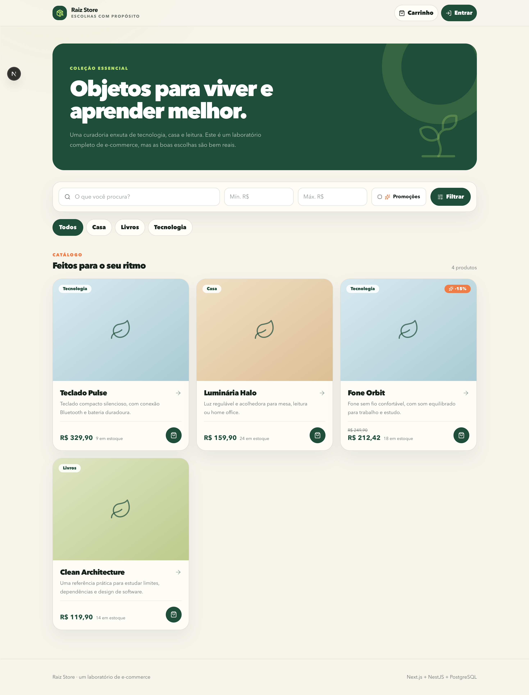
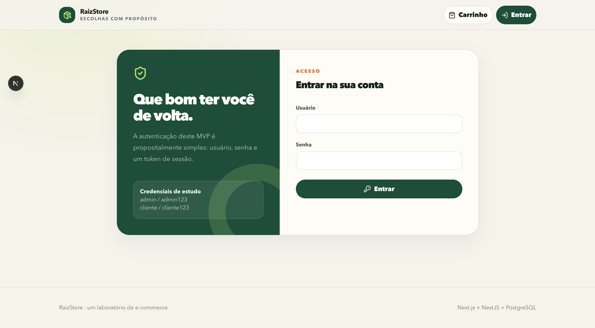
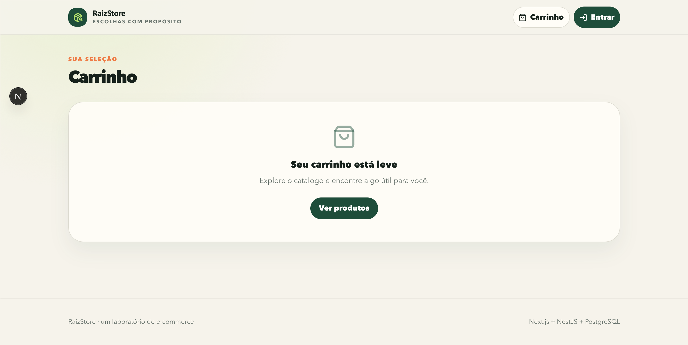
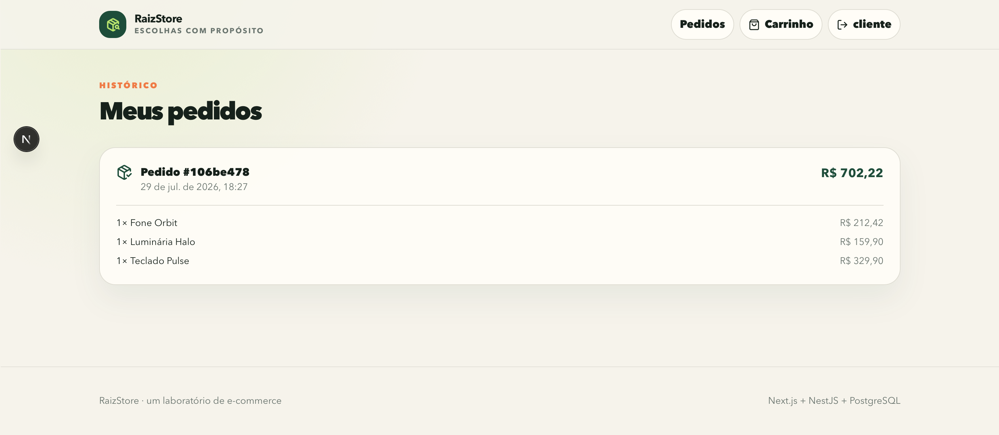
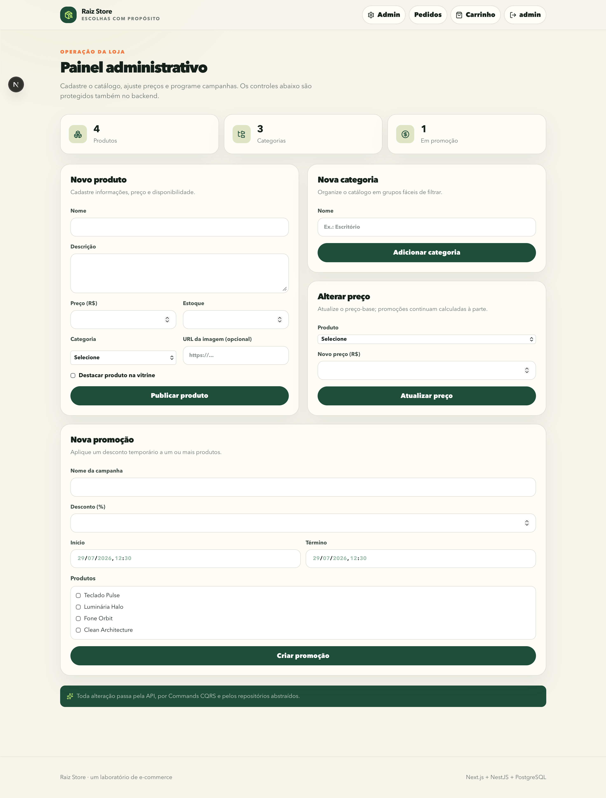

<div align="center">

**English** · [Português (Brasil)](./README.pt-BR.md)

# RaizStore

**A full-stack e-commerce application built to explore software engineering best practices with Artificial Intelligence.**

This project was built entirely with **ChatGPT/Codex**, based on human requirements and direction, using **version-controlled Skills** to guide implementation and preserve its architecture.

**Next.js · NestJS · PostgreSQL · Tailwind CSS · Turborepo**

</div>

## About the project

RaizStore is an educational storefront MVP with dedicated customer and administrator experiences. More than showcasing e-commerce features, the project demonstrates how AI can build and maintain well-structured software when guided by explicit quality standards.

Its foundation applies **Clean Code, SOLID, DDD, and CQRS**, with shared contracts between frontend and backend, infrastructure decoupled through interfaces, and interactive API documentation powered by **Swagger**.

## Product preview

<p align="center">
  <a href="./docs/screenshots/home.png">
    
  </a>
</p>

<p align="center"><sub>Click the image to view it in full resolution.</sub></p>

<details>
  <summary><strong>Explore sign-in, cart, orders, and the admin dashboard</strong></summary>
  <br />

  <p><strong>Authentication</strong></p>
  <a href="./docs/screenshots/login.png">
    
  </a>

  <p><strong>Shopping cart</strong></p>
  <a href="./docs/screenshots/cart.png">
    
  </a>

  <p><strong>Order history</strong></p>
  <a href="./docs/screenshots/orders.png">
    
  </a>

  <p><strong>Admin dashboard</strong></p>
  <a href="./docs/screenshots/admin.png">
    
  </a>
</details>

## Features

**Customer experience**

- Catalog search and filters by category, price range, and promotions.
- Editable shopping cart, checkout, and order history.
- Simple role-based authentication for customers and administrators.

**Store operations**

- Product creation with price, inventory, and category.
- Category management and price updates.
- Time-bound promotional campaigns.
- Administrative routes and actions protected by the backend.

## Engineering and architecture

| Area          | Main decisions                                           |
| ------------- | -------------------------------------------------------- |
| Frontend      | Next.js, React, TypeScript, and Tailwind CSS             |
| Backend       | NestJS, DDD, CQRS, SOLID, and Clean Code                 |
| Data          | PostgreSQL with Prisma ORM and migrations                |
| Integration   | Shared TypeScript contracts between frontend and backend |
| Documentation | OpenAPI with Swagger at `/docs`                          |
| Monorepo      | npm workspaces and Turborepo                             |

The backend is organized into the `identity`, `catalog`, and `sales` bounded contexts. Controllers translate HTTP requests and dispatch Commands or Queries; business rules remain in the domain, and handlers depend on ports. Prisma, JWT, and bcrypt are replaceable adapters, making testing and future infrastructure changes easier.

During checkout, the backend recalculates prices and promotions and persists the order transactionally, without trusting totals submitted by the client.

```text
RaizStore/
├── apps/
│   ├── web/          # Next.js + Tailwind CSS
│   └── api/          # NestJS + CQRS + Swagger
├── packages/
│   └── contracts/    # Shared interfaces
└── .agents/
    └── skills/       # Stack-specific construction and maintenance rules
```

## AI guided by Skills

Skills were used for more than bootstrapping the project. They were derived from the codebase itself and versioned in the repository to guide future evolution without eroding its architectural decisions:

- [`maintain-store-frontend`](./.agents/skills/maintain-store-frontend/SKILL.md): preserves routes, features, providers, HTTP integration, and the visual language.
- [`maintain-store-backend`](./.agents/skills/maintain-store-backend/SKILL.md): preserves DDD, CQRS, the domain, ports, and adapters.
- [`maintain-store-contracts`](./.agents/skills/maintain-store-contracts/SKILL.md): coordinates contract changes between applications.
- Stack-specific Skills support new implementations in [Next.js](./.agents/skills/typescript-nextjs-store/SKILL.md) and [NestJS](./.agents/skills/typescript-nestjs-cqrs/SKILL.md).

This approach turns architecture, patterns, and conventions into reusable context for AI, making maintenance more predictable and consistent.

## Running locally

**Requirements:** Node.js 20+, npm, and PostgreSQL.

```bash
git clone https://github.com/raulgdias/raiz-store.git
cd raiz-store
npm install

cp .env.example .env
cp apps/api/.env.example apps/api/.env
cp apps/web/.env.example apps/web/.env.local

createdb -h localhost -U postgres RaizStore
npm run db:generate
npm run db:migrate
npm run db:seed
npm run dev
```

| Service | Address                      |
| ------- | ---------------------------- |
| Store   | `http://localhost:3000`      |
| API     | `http://localhost:3001/api`  |
| Swagger | `http://localhost:3001/docs` |

Credentials created by the seed:

- Administrator: `admin` / `admin123`
- Customer: `cliente` / `cliente123`

Passwords are stored as hashes and are intended exclusively for the study environment.

## Quality

```bash
npm run lint
npm run typecheck
npm run test
npm run build
```

---

<div align="center">
  A study project about software engineering, sustainable architecture, and AI-assisted development.
</div>
